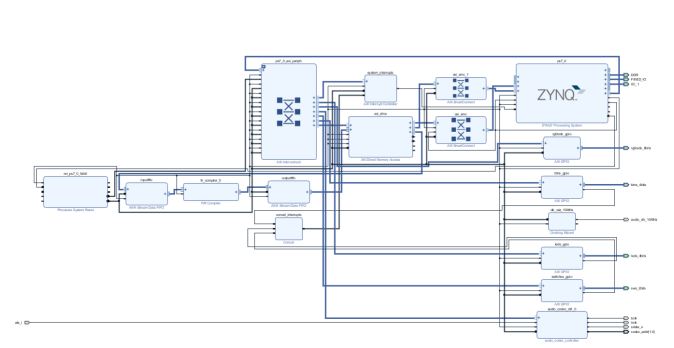

# FIR-Filter-Hardware-Implementation-PYNQ
FIR Filter Implementation on PYNQ FPGA Board for Audio Restoration by removing noises.

This code was developed for purely academic purposes by (ADG4050) as part of the module of Integrated systems design (EE5M01) in Trinity College Dublin

## PYNQ FPGA BOARD 

PYNQ is an open-source project from Xilinx which integrates software and hardware components for faster development using Zynq devices. PYNQ combines the Python language with FPGA-based Programmable Logic (PL) and an Arm-based Processing System (PS) for building electronic systems. The PYNQ framework allows for user interaction through Jupyter Notebooks. ‘Notebooks’ are interactive documents containing live executable code organized into cells. PYNQ’s Jupyter Notebooks are hosted on the Zynq’s Arm processor and we can access them using a web browser (so long as the PYNQ board and the PC with the web browser are connected to the same network).

## Using the MATLAB FILTER DESIGNER

The Matlab filterDesigner is used for designing and analysing filters. To open the GUI, type filterDesigner into the command window. Figure 1 shows a screenshot of the interface that will appear on your screen. To design a filter, you can enter the desired specifications into the GUI and click the design filter button to implement it. The magnitude response of the filter will then be displayed in the window. 

You can store filters by clicking the store filter button and access stored filters using the filter manager button.

The filter can also be exported as Matlab code by clicking File → Generate Matlab Code.

**Screenshots of low pass filter designed using GUI**

## Filtering a Noisy Audio File

A noisy file can be filtered using this MATLAB FILTER DESIGNER function. Noisy File "speech16.wav" is here restored using the Filter Designer.

## Quantizing of Filter Co-efficients and exporting it.

Filters can be quantized using the inbuilt quantization function in the filter designer. Once Quantized the co-efficients are exported for Hardware Implementation

## FIR FILTER OVERLAY EDIT IN VIVADO

The following Overlay is created for FIR FILTER Implementation in Vivado. The MATLAB generted FILTER co-efficients are inserted in the FIR Compiler IP, with following changes made in it.

Under the Channel Specification tab you will need to edit the Hardware Oversampling Specification section:
a. Decide the appropriate sampling frequency for the audio file.
b. Set the clock frequency to 100 MHz which is the clock frequency of the PYNQ-Z2 board.

Under the Implementation tab:
a. Configure the Coefficient Options section to set the coefficient type as signed, integer coefficients with a 16 bit width.
b. Set the input data as signed 32 bit with 0 fractional bits.
c. Set the output as 32 bit and select the Non Symmetric Rounding Up rounding mode.

Finally the .bit and .hwh file are exported using the Command file for PYNQ Implementation

## PYNQ IMPLEMENTATION

The .bit and .hwh are uploaded in the Jupyter Network framework available through PYNQ - Z2 & the Hardware Implementation is performed.

The Graphs before and after of FIR Implmentation is below

The Jupyter Notebook with Python code used for implementation is attached.

